# MyCodex

[English](README.md) | [简体中文](README.zh-CN.md) | [日本語](README.ja.md) | [한국어](README.ko.md) | [Deutsch](README.de.md) | [Français](README.fr.md)

누구나 무료로 쓸 수 있는 Codex + Hermes. Token, 명령줄, 복잡한 환경 설정 없이 안정적인 워크플로를 만들기 위한 데스크톱 앱입니다.

MyCodex는 Codex + Hermes를 일반 사용자도 바로 열어 쓸 수 있는 작업 공간으로 묶었습니다. 앱을 열고 원하는 결과를 말하면 Agent가 작업을 실행하고, 과정을 보여주고, 결과 파일을 남깁니다. WeChat을 연결하면 컴퓨터 앞에 없을 때도 휴대폰에서 작업을 보내고 파일을 받을 수 있습니다.

## v0.6.1 주요 내용

- cloud auth 연결에 명시적인 타임아웃과 안전한 재시도를 추가해 짧은 네트워크 장애에 더 강해졌습니다.
- 배포용 데스크톱 패키지에 운영 MyCodex 연결 설정을 포함해 첫 실행 시 잘못된 로컬 개발 주소로 연결되는 문제를 줄였습니다.
- Windows 안정 운영을 위한 흐름이 추가되었습니다. 전체 zip 구조, runtime 위치, 패키지 설정을 릴리스 전에 검사합니다.
- macOS Apple Silicon과 Intel 패키지를 0.6.1로 새로 빌드했습니다.
- WeChat과 Hermes 워크플로는 계속 핵심입니다. 작업 전송, 대화 이어가기, 결과 파일 수신에 사용할 수 있습니다.
- 결과는 단순한 답변이 아니라 과정, 결론, 표, 파일, 다음 행동까지 같은 대화에 남습니다.

## 해결하려는 문제

Codex + Hermes를 쓰고 싶은 사람은 많지만, Token, 명령줄, 모델 설정, 환경 변수에서 막히는 경우가 많습니다.

MyCodex는 시작 경로를 다운로드, 로그인, 작업 입력으로 줄입니다. 결과와 과정, 생성 파일은 데스크톱 앱에 남고, WeChat을 연결하면 휴대폰에서도 작업을 보내고 파일을 받을 수 있습니다.

## 화면 둘러보기

### 로그인

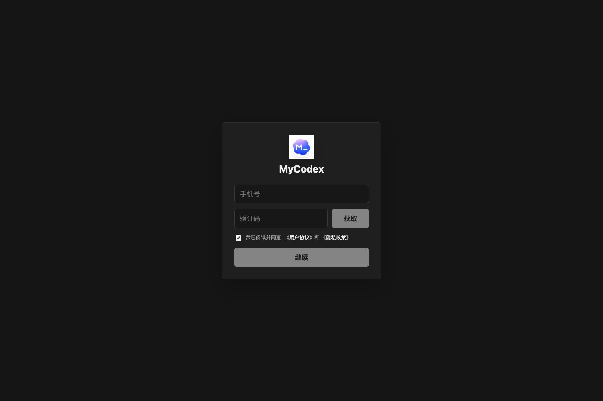

- 휴대폰 인증 코드 로그인.
- 이용약관과 개인정보 처리방침 확인.
- 로그인 상태 복원.
- 로그인 서비스 오류 시 재시도 상태 표시.

### 첫 모델 연결

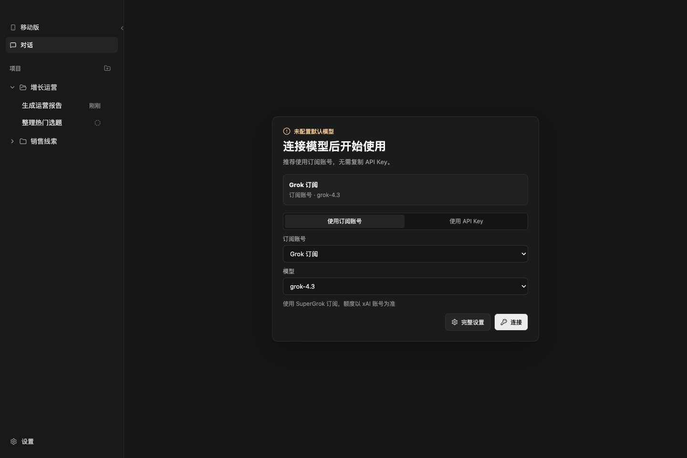

- 구독 계정 연결을 우선 추천합니다.
- API Key 연결도 선택할 수 있습니다.
- 더 자세한 제어가 필요하면 설정 페이지로 이동할 수 있습니다.

### 대화 홈

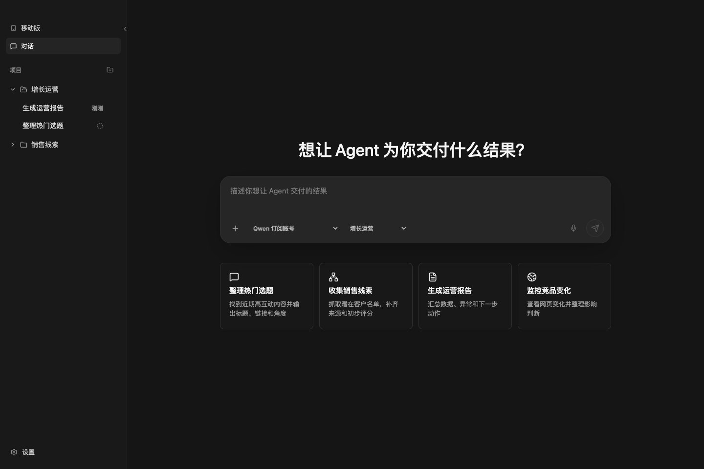

- 작업 목표 입력.
- 모델 선택.
- 프로젝트 선택.
- 이미지나 파일 첨부.
- 자주 쓰는 업무 시나리오로 시작.
- 실행 중인 작업 중지.

기본 시나리오는 인기 주제 정리, 영업 리드 수집, 운영 리포트 생성, 경쟁사 변화 모니터링입니다.

### 프로젝트와 기록

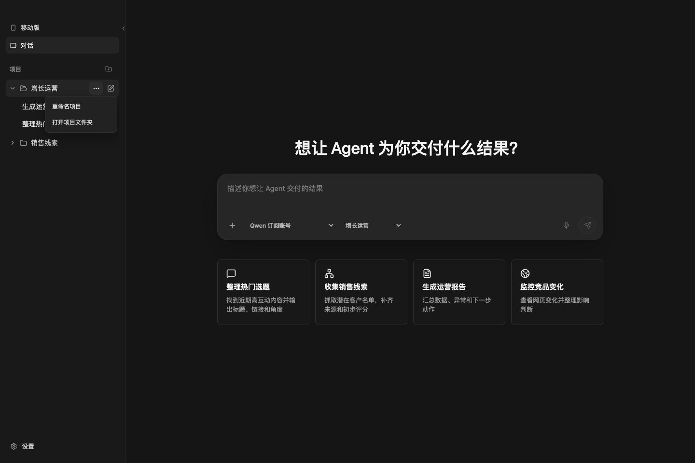

- 프로젝트 생성, 이름 변경, 폴더 열기, 기본 프로젝트 설정.
- 과거 대화 열기와 삭제.
- 실행 중인 대화 상태 표시.

### 실행 중

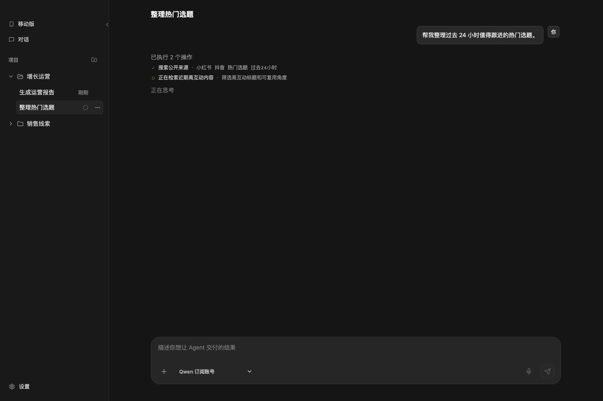

Agent가 지금 무엇을 하는지 볼 수 있습니다. 새로고침하거나 창을 다시 열어도 실행 상태와 이벤트를 복원할 수 있습니다.

### 결과와 파일

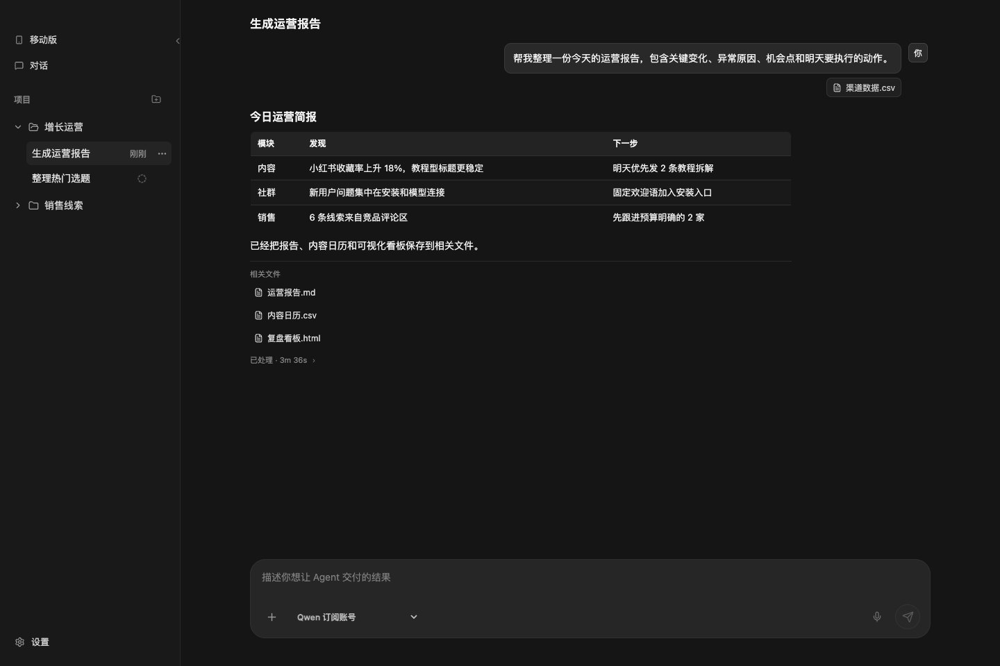

- 최종 결과 표시.
- Markdown, 표, 링크 지원.
- 업로드한 첨부 파일과 생성 파일을 같은 대화에서 관리.
- 문맥을 유지한 채 후속 질문 가능.

### 실행 과정

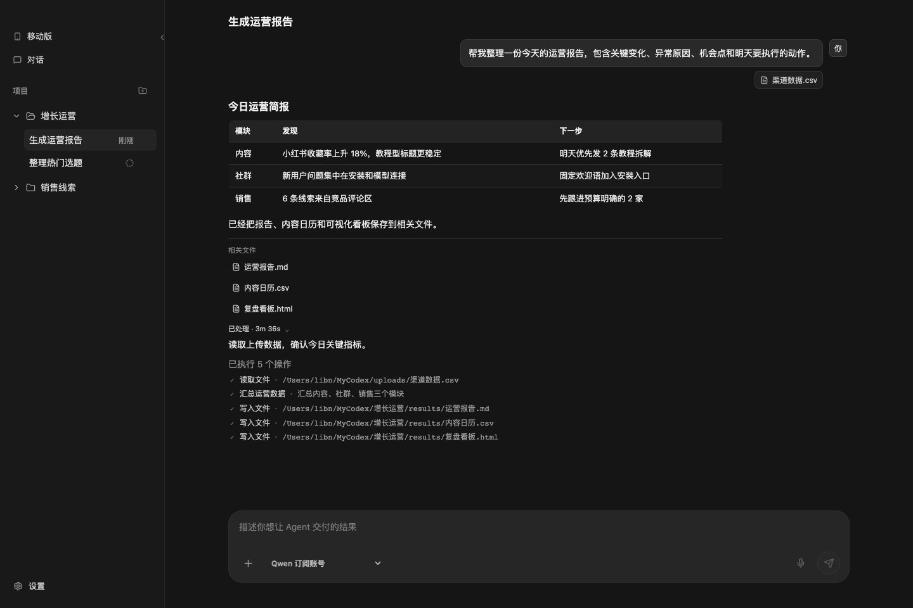

읽기, 검색, 요약, 파일 작성 등 Agent가 수행한 작업을 펼쳐서 확인할 수 있습니다.

### 파일 미리보기

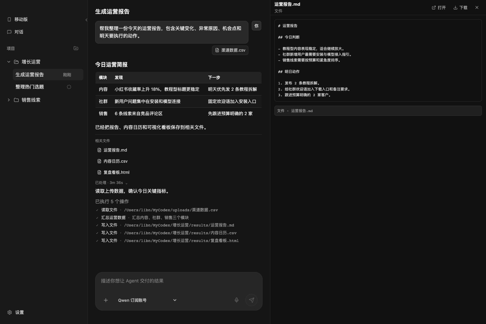

Markdown, CSV, HTML, JSON, 로그, XML, 이미지, PDF 등을 오른쪽에서 바로 볼 수 있습니다. 다운로드와 시스템 앱으로 열기도 지원합니다.

### 모바일 / WeChat

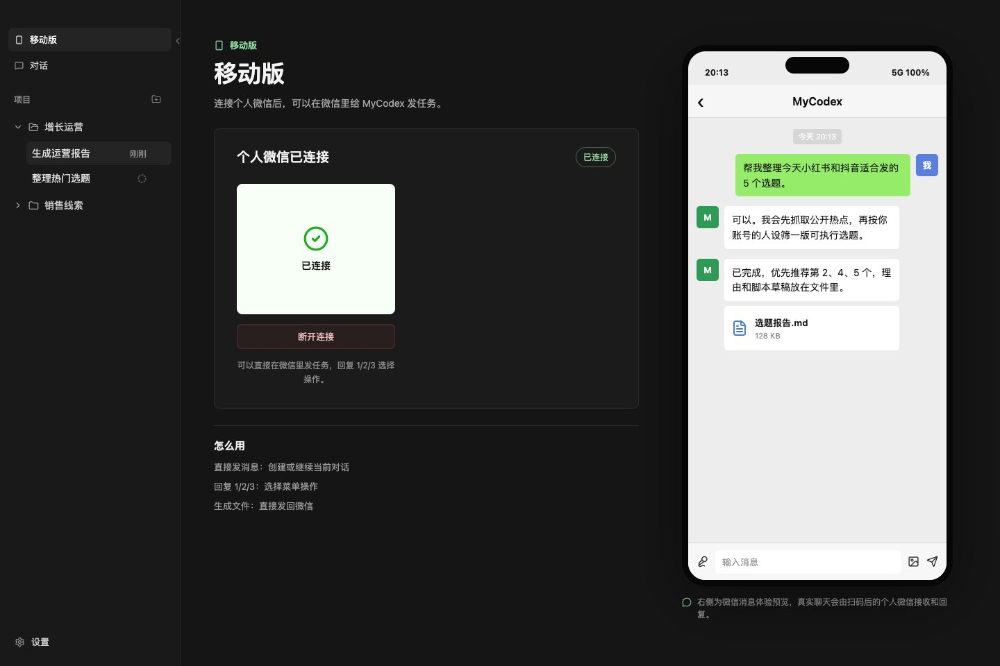

- 개인 WeChat 연결 상태 확인.
- QR 코드 생성.
- WeChat에서 MyCodex로 작업 보내기.
- `1/2/3` 답장으로 메뉴 동작 선택.
- 생성된 파일을 WeChat으로 다시 받기.

### 설정

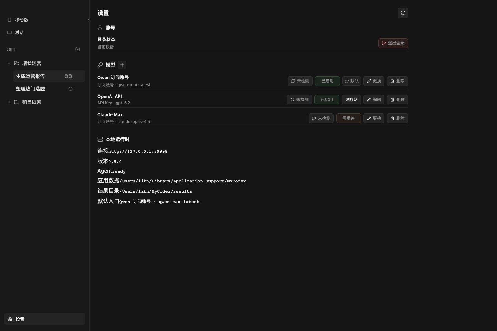

- 로그인 상태와 로그아웃.
- 모델 목록, 연결 검사, 활성화, 기본 모델 설정, 편집, 삭제.
- 로컬 runtime URL, 버전, Agent 상태, 앱 데이터 디렉터리, 결과 디렉터리.

### 구독 계정 연결

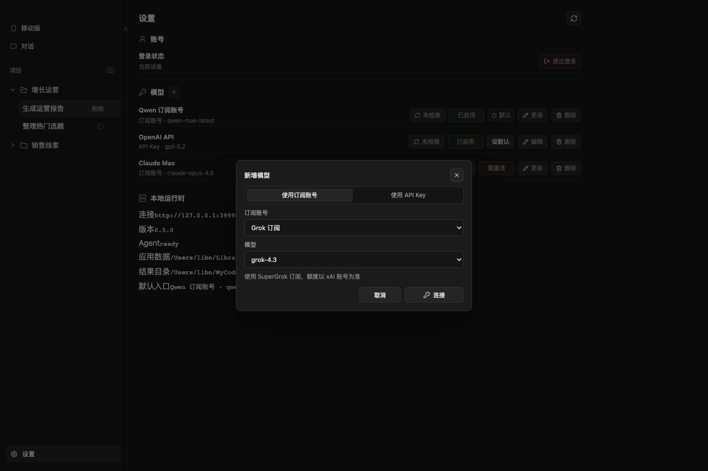

Grok, Nous, ChatGPT / Codex, Gemini, MiniMax, Qwen, GitHub Copilot, Claude Max 등의 연결 입구를 제공합니다.

### API Key 연결

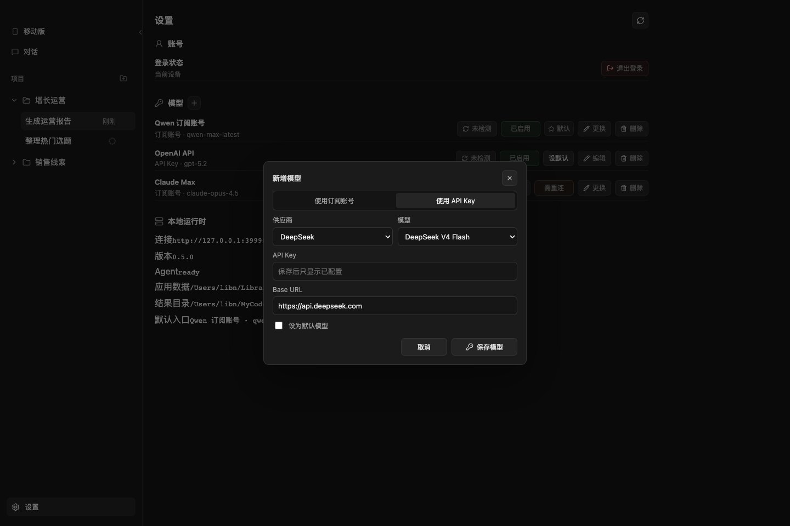

자신의 API Key를 쓰는 사용자는 공급자, 모델, API Key, Base URL, 기본 모델 여부를 지정할 수 있습니다.

## 다운로드

소스 코드는 아직 공개하지 않습니다. 현재는 패키징된 설치 파일을 먼저 제공합니다.

- macOS Apple Silicon: `MyCodex-0.6.1-mac-arm64.dmg` 또는 `MyCodex-0.6.1-mac-arm64.zip`
- macOS Intel: `MyCodex-0.6.1-mac-x64.dmg` 또는 `MyCodex-0.6.1-mac-x64.zip`
- Windows x64: 0.6.1에는 Windows 안정 운영 개선이 포함되어 있지만, 배포용 Windows zip은 Windows runtime target build가 준비된 뒤 추가할 예정입니다. 지금은 이전 Release의 portable 패키지를 사용하세요.

[GitHub Releases](https://github.com/guo2001china/mycodex/releases)에서 받을 수 있습니다.

## 커뮤니티

MyCodex를 더 많은 사람이 쓸 수 있도록 커뮤니티에 참여해 주세요.

추가할 때 비고에 `MyCodex`라고 적어 주세요.

## 상태

MyCodex는 아직 early preview입니다. 먼저 테스트 폴더나 중요도가 낮은 워크플로에서 사용해 본 뒤 중요한 작업으로 옮기는 것을 권장합니다.
