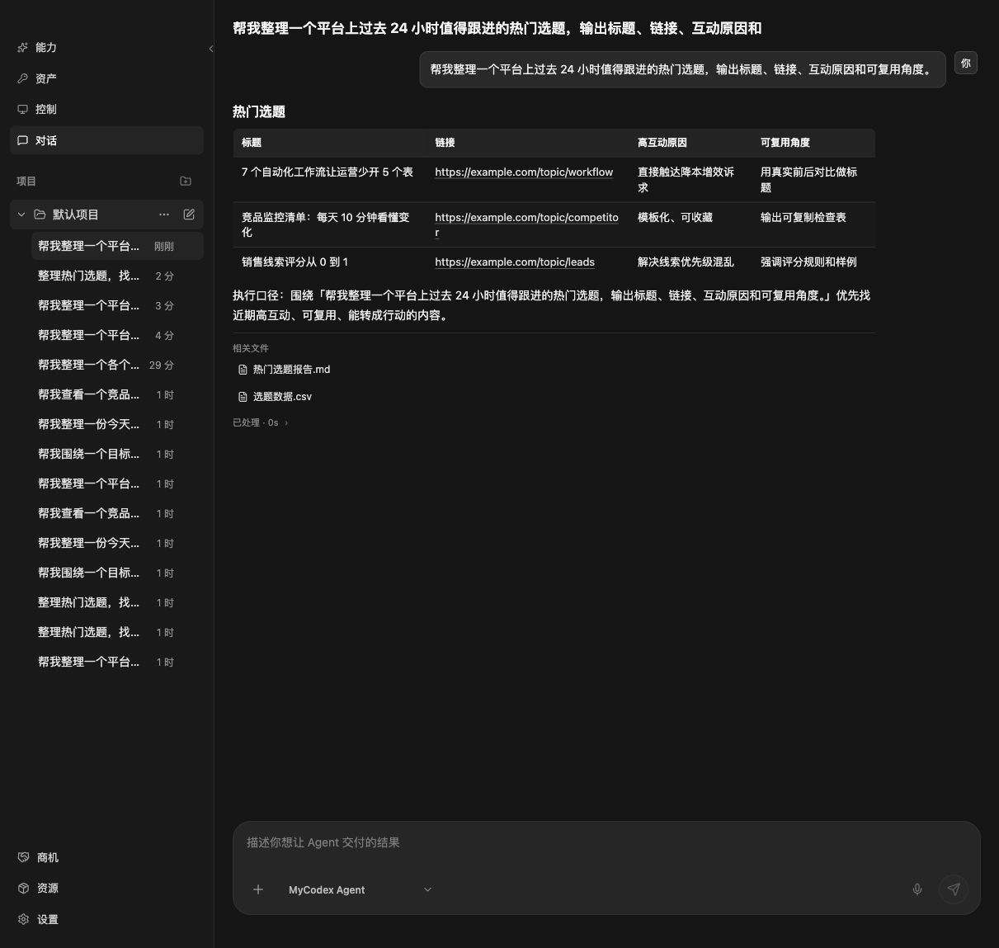
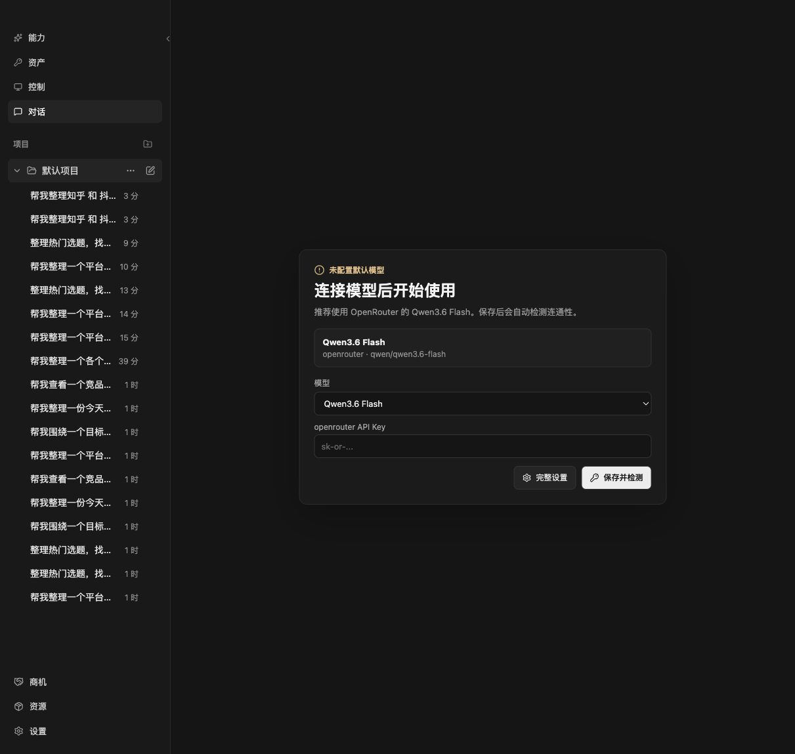
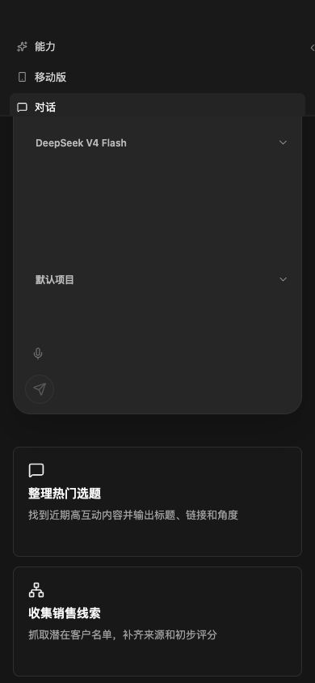

# MyCodex

人人都能免费用的 Codex + Hermes，让你的工作流程免 TOKEN、稳定、高效。

MyCodex 不是给用户学习 AI 概念的，是让用户把事情交出去，然后等结果回来。

## 0.5.0 发布重点

- 支持用微信管理 MyCodex：在微信里发任务、继续对话、查看结果和接收文件。
- 支持用微信管理 Hermes：把 Hermes 执行能力接到 MyCodex 工作流里，用更接近聊天的方式调度 Agent。
- 支持自动化控制电脑和手机：适合重复点击、跨页面整理、手机消息入口和需要人机协作的流程。
- 支持隐私浏览器方向：把登录、访问、自动化浏览和账号隔离放进更可控的环境里，减少主浏览器污染。
- 更适合普通用户：少解释概念，少填参数，直接给结果、文件和下一步。

## 更多人可以怎么用

- 老板和负责人：在微信里丢一句话，让 MyCodex 整理进展、竞品、客户和待办。
- 运营同学：批量整理热门选题、活动复盘、社群话术和内容日历。
- 销售同学：收集线索、补齐客户资料、生成跟进建议和汇总表。
- 助理和客服：把零散消息、网页资料和文件整理成可交付结果。
- 不懂技术的人：下载、登录、扫码，加社群，不需要理解 Token、环境变量和命令行。

## 能帮你做什么

- 一句话下任务：整理选题、找销售线索、生成运营报告、监控竞品变化。
- 微信里发任务：让 MyCodex 和 Hermes 帮你继续跑任务、回结果、发文件。
- 自动化处理重复流程：把电脑、手机、浏览器里的重复动作交给 Agent 编排。
- 结果直接能看：表格、链接、结论、执行路径和下一步动作都在同一个对话里。
- 文件自动留下：Agent 生成的 markdown、csv、html、json、text 等产物会保存，方便复用。
- 项目和对话自动归档：不用记历史，不用翻聊天软件，回到项目里继续追问。
- 手机也能接上：移动版支持微信入口，适合不想一直守在电脑前的人。
- 配置尽量收起来：普通用户只看 Agent、项目、对话和结果；模型和 runtime 状态放在设置里。

## 截图

打开就是输入框，用户只需要说想要什么结果。

Agent 会把结果、执行路径和产物放在同一个页面里。

需要配置时集中在设置里，不打扰主流程。

窄屏和移动入口也能用，不只服务桌面重度用户。

## 下载

当前先发布 Windows x64 portable 包和 macOS 安装包，源码暂不发布。

请到 [GitHub Releases](https://github.com/guo2001china/mycodex/releases) 查看最新发布说明。安装体验请下载已有安装包。

## 使用

Windows：

1. 下载 `MyCodex-0.1.0-windows-x64-portable.zip`。
2. 解压整个文件夹。
3. 运行解压目录里的 `MyCodex.exe`。

macOS：

1. 下载 `MyCodex-0.1.0-mac-arm64.dmg`。
2. 打开 dmg 后拖拽安装 `MyCodex.app`。

## 适合谁

- 想用 Codex + Hermes 工作流，但不想折腾 Token、环境和命令行的普通用户。
- 想把本地任务、文件处理、自动化执行集中在一个桌面工作台里的效率用户。
- 想先体验稳定安装包，再决定是否深入了解技术细节的团队。

## 加入社群

加入社群，让 MyCodex 更普惠。

扫码添加时请备注：`MyCodex`

## 当前状态

这是早期预览版。0.5.0 先更新能力方向和发布说明，安装包会继续补齐；建议先在测试目录或非关键项目中体验，再用于重要工作流。
